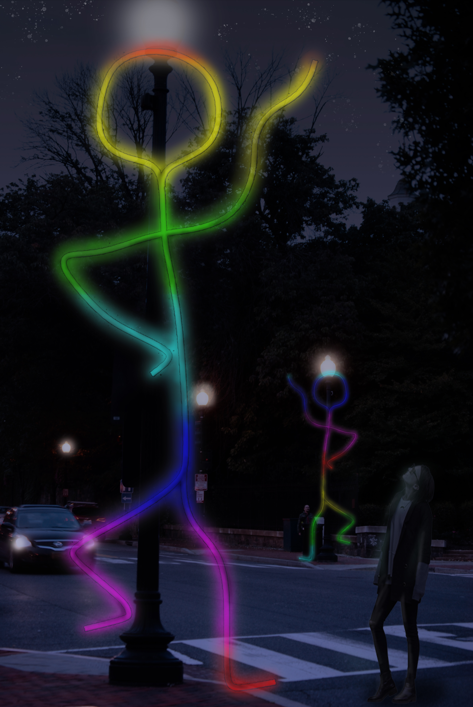

# Friends
## Arduino NeoPixel Light Sculpture

This project was an outdoor light sculpture for Georgetown Glow 2018. https://www.georgetownglowdc.com/glow

There were 3 large (approximately 6 meters tall) figures. They were essentially stick figures. This project was in collaboration with the Tuesday Night Group (figure drawing group) and Klagsbrun Studios. 
So, the ideas was to make it look like the figures were being drawn with light: lighting them up as if a line was being drawn. 

The first figure would determine a color and transmit that to the second figure, who would transmit it to the third. 

Since each figure could be at a different place in their routines, they mey not have been able to listen in on their radio channel, and thus miss the message. 
Sometimes all three figures would be lit the same color, sometimes just two, and sometimes they would all be different colors. 
This represented how friends communicate and interact -- sometimes they are all together doing the same thing (same color), sometimes only some could meet, and sometimes they are all doing different things. 

Threee Arduino Megas were used, along with RFM69 transceivers. 

